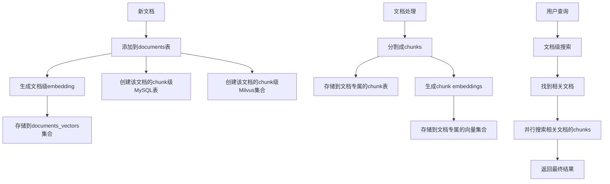

# RAG系统两级数据库架构

## 📋 概述

这是一个专门为RAG（检索增强生成）系统设计的两级数据库架构，实现了**文档级**和**Chunk级**的分层存储和搜索。

### 🎯 设计理念

根据RAG系统的搜索逻辑，我们设计了两级数据库架构：

1. **第一级（文档级）**：存储文档的总结、关键词、文档级embedding，用于快速筛选相关文档
2. **第二级（Chunk级）**：每个文档都有独立的MySQL表和Milvus集合，存储该文档的所有chunks，用于精细化搜索

### 🔍 搜索流程

```
用户输入
    ↓
1️⃣ 文档级搜索（关键词 + 向量）
    ↓
找到相关文档ID列表
    ↓
2️⃣ 并行搜索这些文档的chunks（关键词 + 向量）
    ↓
返回最相关的chunks
```

## 🏗️ 架构设计

### 两级数据库结构

```
RAG数据库系统
├── 文档级数据库
│   ├── MySQL: documents表 (文档基本信息、总结、关键词)
│   └── Milvus: documents_vectors集合 (文档级embedding)
│
└── Chunk级数据库 (每个文档都有独立的)
    ├── MySQL: doc_20241218_123456_chunks表 (该文档的所有chunks)
    └── Milvus: doc_20241218_123456_chunks_vectors集合 (chunk向量)
```

### 数据流图



## 🚀 快速开始

### 1. 环境准备

```bash
# 启动数据库服务
cd db_server
docker-compose up -d

# 创建实验环境
python experiment_manager.py --create rag_experiment --researcher "BinLiang"
python experiment_manager.py --switch rag_experiment
```

### 2. 基本使用

```python
from knowledge_rag.db_utils.rag_document_manager import RAGDocumentManager
from knowledge_rag.db_utils.rag_search_engine import RAGSearchEngine
from knowledge_rag.db_utils.rag_schema_config import RAGSchemaConfig

# 创建管理器
rag_manager = RAGDocumentManager()
search_engine = RAGSearchEngine()
schema_config = RAGSchemaConfig()

# 添加文档
doc_id = rag_manager.add_document(
    title="深度学习基础",
    summary="本文介绍了深度学习的基本概念和算法",
    keywords=["深度学习", "神经网络", "机器学习"],
    document_embedding=[0.1, 0.2, 0.3, ...],  # 文档级向量
    chunk_schema_config=schema_config.get_chunk_schema("academic")
)

# 完整的两级搜索
results = search_engine.full_search(
    keywords="神经网络 卷积",
    query_vector=[0.1, 0.2, 0.3, ...],
    doc_top_k=10,
    chunk_top_k_per_doc=5
)

print(f"找到 {results['search_stats']['doc_count']} 个相关文档")
print(f"找到 {results['search_stats']['chunk_count']} 个相关chunks")
```

## 📊 数据库结构详解

### 文档级数据库

#### documents表（MySQL）

| 字段 | 类型 | 说明 |
|------|------|------|
| `id` | BIGINT | 文档唯一ID |
| `title` | VARCHAR(1000) | 文档标题 |
| `summary` | TEXT | 文档总结 |
| `keywords` | TEXT | 关键词（逗号分隔） |
| `chunk_mysql_table` | VARCHAR(255) | 该文档的chunk表名 |
| `chunk_milvus_collection` | VARCHAR(255) | 该文档的chunk集合名 |
| `chunk_count` | INT | chunk数量 |
| `processing_status` | ENUM | 处理状态 |
| `created_at` | DATETIME | 创建时间 |

#### documents_vectors集合（Milvus）

| 字段 | 类型 | 维度 | 说明 |
|------|------|-------|------|
| `id` | INT64 | - | 文档ID |
| `document_embedding` | FLOAT_VECTOR | 768 | 文档级向量 |
| `summary_embedding` | FLOAT_VECTOR | 768 | 摘要向量 |
| `keywords_embedding` | FLOAT_VECTOR | 768 | 关键词向量 |
| `metadata` | JSON | - | 元数据 |

### Chunk级数据库（每个文档独立）

#### doc_xxx_chunks表（MySQL）

| 字段 | 类型 | 说明 |
|------|------|------|
| `id` | BIGINT | chunk ID |
| `chunk_index` | INT | chunk序号 |
| `chunk_text` | LONGTEXT | chunk文本内容 |
| `chunk_title` | VARCHAR(500) | chunk标题 |
| `keywords` | TEXT | chunk关键词 |
| `token_count` | INT | token数量 |
| `created_at` | DATETIME | 创建时间 |

#### doc_xxx_chunks_vectors集合（Milvus）

| 字段 | 类型 | 维度 | 说明 |
|------|------|-------|------|
| `id` | INT64 | - | chunk ID |
| `chunk_embedding` | FLOAT_VECTOR | 768 | chunk文本向量 |
| `title_embedding` | FLOAT_VECTOR | 768 | chunk标题向量 |
| `metadata` | JSON | - | chunk元数据 |

## 🔧 灵活的Schema配置

系统提供了灵活的配置方式，支持不同类型的文档：

### 1. 预设配置类型

```python
schema_config = RAGSchemaConfig()

# 学术论文配置
academic_schema = schema_config.get_chunk_schema("academic")

# 商业文档配置  
business_schema = schema_config.get_chunk_schema("business")

# 自定义配置
custom_schema = schema_config.get_chunk_schema("custom")
```

### 2. 自定义配置

在 `rag_schema_config.py` 的 `_get_custom_*_schema()` 方法中修改：

```python
def _get_custom_chunk_schema(self) -> Dict:
    return {
        "mysql": {
            "columns": [
                # 必需字段
                {"name": "id", "type": "BIGINT", "auto_increment": True, "primary_key": True},
                {"name": "chunk_text", "type": "LONGTEXT", "not_null": True},
                
                # 🔧 添加你的自定义字段
                {"name": "custom_field", "type": "VARCHAR(500)", "comment": "自定义字段"},
                {"name": "custom_score", "type": "DECIMAL(5,2)", "comment": "自定义评分"},
            ],
            "indexes": [
                {"name": "fulltext_content", "columns": ["chunk_text"], "type": "FULLTEXT"},
                # 🔧 添加你的自定义索引
            ]
        },
        "milvus": {
            "fields": [
                {"name": "id", "type": "INT64", "is_primary": True, "auto_id": False},
                # 🔧 添加你的向量字段
                {"name": "custom_embedding", "type": "FLOAT_VECTOR", "dim": 768},
            ]
        }
    }
```

## 🔍 搜索功能详解

### 1. 文档级搜索

```python
# 关键词搜索
docs = search_engine.search_documents_by_keywords(
    keywords="机器学习 深度学习",
    search_fields=["title", "summary", "keywords"],
    top_k=10
)

# 向量搜索
docs = search_engine.search_documents_by_vector(
    query_vector=[0.1, 0.2, ...],
    vector_field="document_embedding",
    similarity_threshold=0.7,
    top_k=10
)

# 混合搜索
docs = search_engine.search_documents(
    keywords="机器学习",
    query_vector=[0.1, 0.2, ...],
    combine_results=True,
    keyword_weight=0.3,
    vector_weight=0.7
)
```

### 2. Chunk级搜索

```python
# 单文档chunk搜索
chunks = search_engine.search_chunks_in_document(
    doc_id=123,
    keywords="卷积神经网络",
    query_vector=[0.1, 0.2, ...],
    top_k=5
)

# 并行搜索多文档的chunks
chunk_results = search_engine.search_chunks_parallel(
    doc_ids=[123, 456, 789],
    keywords="注意力机制",
    query_vector=[0.1, 0.2, ...],
    top_k_per_doc=5,
    max_total_results=50
)
```

### 3. 完整两级搜索

```python
# 一站式搜索，自动完成两级搜索流程
results = search_engine.full_search(
    keywords="transformer attention",
    query_vector=[0.1, 0.2, ...],
    doc_top_k=10,
    chunk_top_k_per_doc=5,
    max_total_chunks=50
)

# 结果结构
{
    "relevant_documents": [...],      # 相关文档列表
    "chunk_results": {               # chunk搜索结果
        123: [chunk1, chunk2, ...],  # 文档123的相关chunks
        456: [chunk3, chunk4, ...]   # 文档456的相关chunks
    },
    "search_stats": {                # 搜索统计
        "doc_count": 5,
        "chunk_count": 25,
        "docs_with_chunks": 3
    }
}
```

## 📝 数据管理

### 1. 文档管理

```python
rag_manager = RAGDocumentManager()

# 添加文档
doc_id = rag_manager.add_document(
    title="AI研究报告",
    summary="关于人工智能发展的研究报告",
    keywords=["人工智能", "机器学习", "发展趋势"],
    document_embedding=[...],
    chunk_schema_config=schema_config.get_chunk_schema("academic")
)

# 查看文档信息
doc_info = rag_manager.get_document_info(doc_id)
print(f"Chunk表名: {doc_info['chunk_mysql_table']}")
print(f"Chunk集合名: {doc_info['chunk_milvus_collection']}")

# 列出所有文档
docs = rag_manager.list_documents(status="completed", limit=20)

# 更新文档状态
rag_manager.update_document_status(doc_id, "completed", chunk_count=50)

# 删除文档（会删除所有关联的chunk数据）
rag_manager.delete_document(doc_id, force=False)
```

### 2. Chunk数据操作

```python
# 向特定文档添加chunks（需要直接操作chunk级数据库）
from knowledge_rag.db_utils.database_clients import MySQLClient, MilvusClient

doc_info = rag_manager.get_document_info(doc_id)
mysql_client = rag_manager.mysql_client
milvus_client = rag_manager.milvus_client

# 插入chunk到MySQL
chunk_data = {
    "chunk_index": 1,
    "chunk_text": "这是第一个chunk的内容...",
    "chunk_title": "第一章 引言",
    "keywords": "引言,背景,研究目标",
    "token_count": 150
}

insert_sql = f"""
INSERT INTO `{rag_manager.db_name}`.`{doc_info['chunk_mysql_table']}`
(chunk_index, chunk_text, chunk_title, keywords, token_count)
VALUES (%s, %s, %s, %s, %s)
"""

chunk_id = mysql_client.execute(
    insert_sql, 
    (chunk_data["chunk_index"], chunk_data["chunk_text"], 
     chunk_data["chunk_title"], chunk_data["keywords"], 
     chunk_data["token_count"]),
    fetch_lastrowid=True
)

# 插入chunk向量到Milvus
vector_data = {
    "id": chunk_id,
    "chunk_embedding": [0.1, 0.2, 0.3, ...],  # chunk文本向量
    "title_embedding": [0.4, 0.5, 0.6, ...],  # chunk标题向量
    "metadata": {"source": "pdf_page_1"}
}

milvus_client.insert(doc_info['chunk_milvus_collection'], vector_data)
```

## 🎯 实际使用场景

### 场景1：学术论文检索系统

```python
# 1. 配置学术论文schema
schema_config = RAGSchemaConfig()
academic_doc_schema = schema_config.get_document_mysql_schema("academic")
academic_chunk_schema = schema_config.get_chunk_schema("academic")
academic_search_config = schema_config.get_search_config("academic")

# 2. 添加论文
doc_id = rag_manager.add_document(
    title="Attention Is All You Need",
    summary="Transformer架构的开创性论文",
    keywords=["transformer", "attention", "neural networks"],
    # 学术专有字段
    metadata={
        "authors": "Vaswani et al.",
        "journal": "NIPS 2017",
        "doi": "10.5555/3295222.3295349",
        "research_field": "Natural Language Processing"
    },
    document_embedding=document_vector,
    chunk_schema_config=academic_chunk_schema
)

# 3. 学术搜索
results = search_engine.search_documents(
    keywords="attention mechanism transformer",
    mysql_search_fields=["title", "abstract", "authors", "keywords"],
    vector_field="abstract_embedding"
)
```

### 场景2：企业知识库

```python
# 1. 配置商业文档schema
business_doc_schema = schema_config.get_document_mysql_schema("business")
business_chunk_schema = schema_config.get_chunk_schema("business")

# 2. 添加企业文档
doc_id = rag_manager.add_document(
    title="2024年度市场分析报告",
    summary="详细分析了2024年的市场趋势和机会",
    keywords=["市场分析", "趋势预测", "商业机会"],
    metadata={
        "department": "市场部",
        "document_type": "report",
        "confidentiality": "internal",
        "owner": "张经理"
    },
    document_embedding=document_vector,
    chunk_schema_config=business_chunk_schema
)

# 3. 企业搜索
results = search_engine.search_documents(
    keywords="市场趋势 增长机会",
    additional_filters={"department": "市场部", "confidentiality": "internal"}
)
```

## ⚡ 性能优化建议

### 1. 索引优化

```python
# 文档级全文索引
"indexes": [
    {"name": "ft_summary", "columns": ["summary"], "type": "FULLTEXT"},
    {"name": "ft_keywords", "columns": ["keywords"], "type": "FULLTEXT"}
]

# Chunk级全文索引
"indexes": [
    {"name": "fulltext_content", "columns": ["chunk_text"], "type": "FULLTEXT"},
    {"name": "idx_chunk_index", "columns": ["chunk_index"], "type": "INDEX"}
]
```

### 2. 向量索引优化

```python
# 大规模数据使用IVF_SQ8节省内存
{"field": "chunk_embedding", "type": "IVF_SQ8", "metric": "L2", "params": {"nlist": 2048}}

# 小规模数据使用IVF_FLAT获得更高精度
{"field": "title_embedding", "type": "IVF_FLAT", "metric": "L2", "params": {"nlist": 1024}}
```

### 3. 搜索参数调优

```python
# 根据数据规模调整参数
search_params = {
    "doc_top_k": 20,              # 文档级返回数量
    "chunk_top_k_per_doc": 5,     # 每文档chunk数量
    "max_total_chunks": 100,      # 总chunk限制
    "similarity_threshold": 0.6,   # 相似度阈值
    "keyword_weight": 0.3,        # 关键词权重
    "vector_weight": 0.7          # 向量权重
}
```

## 🚨 注意事项

### 1. 数据一致性

- 删除文档时会自动删除所有关联的chunk数据
- 确保文档级和chunk级的ID对应关系正确
- 定期检查数据库连接状态

### 2. 向量维度一致性

```python
# 确保所有向量字段使用相同的维度
document_embedding = model.encode(document_text)  # 768维
chunk_embedding = model.encode(chunk_text)        # 必须也是768维
```

### 3. 搜索字段配置

```python
# 确保搜索字段在对应的表结构中存在
mysql_search_fields = ["chunk_text", "chunk_title", "keywords"]  # 必须是实际的列名
milvus_vector_fields = ["chunk_embedding", "title_embedding"]    # 必须是实际的字段名
```

## 🔧 故障排查

### 1. 连接问题

```bash
# 检查服务状态
docker-compose ps

# 重启服务
docker-compose restart mysql milvus

# 检查日志
docker-compose logs mysql
docker-compose logs milvus
```

### 2. 数据库问题

```python
# 检查文档信息
doc_info = rag_manager.get_document_info(doc_id)
print(f"Chunk表: {doc_info['chunk_mysql_table']}")
print(f"Chunk集合: {doc_info['chunk_milvus_collection']}")

# 检查表是否存在
mysql_client.execute(f"SHOW TABLES LIKE '{doc_info['chunk_mysql_table']}'")
```

### 3. 搜索问题

```python
# 检查搜索配置
search_config = schema_config.get_search_config("custom")
print(f"搜索字段: {search_config['chunk_level']['mysql_search_fields']}")
print(f"向量字段: {search_config['chunk_level']['milvus_vector_fields']}")
```

## 📚 API参考

### RAGDocumentManager

| 方法 | 说明 |
|------|------|
| `add_document()` | 添加新文档，自动创建chunk级数据库 |
| `get_document_info()` | 获取文档详细信息 |
| `list_documents()` | 列出文档列表 |
| `delete_document()` | 删除文档及所有chunk数据 |
| `update_document_status()` | 更新文档处理状态 |

### RAGSearchEngine

| 方法 | 说明 |
|------|------|
| `search_documents()` | 文档级搜索 |
| `search_chunks_in_document()` | 单文档chunk搜索 |
| `search_chunks_parallel()` | 并行chunk搜索 |
| `full_search()` | 完整两级搜索 |

### RAGSchemaConfig

| 方法 | 说明 |
|------|------|
| `get_document_mysql_schema()` | 获取文档级MySQL结构 |
| `get_document_milvus_schema()` | 获取文档级Milvus结构 |
| `get_chunk_schema()` | 获取chunk级数据库结构 |
| `get_search_config()` | 获取搜索配置 |

---

## ✅ 总结

这个两级RAG数据库架构提供了：

1. **灵活的数据结构**：支持学术、商业、自定义等多种文档类型
2. **高效的搜索**：两级搜索，先筛选文档再精确检索chunks
3. **独立的存储**：每个文档有独立的chunk级数据库，便于管理
4. **并行处理**：支持多文档chunks的并行搜索
5. **易于扩展**：灵活的schema配置，方便后续修改

开始使用你的RAG系统吧！🚀